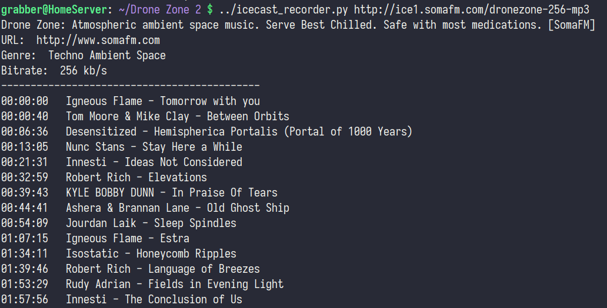
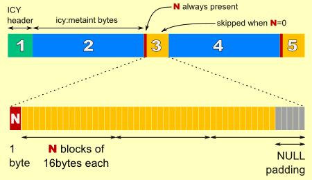

# Icecast recorder
Script for downloading a stream from IceCast-compatible servers. Uses information from icy protocol to split stream into separate tracks



# Usage
As in the screenshot.

Python3 is required. No additional dependencies.
```
wget https://raw.githubusercontent.com/Jipok/icecast_recorder/master/icecast_recorder.py
chmod +x icecast_recorder.py

./icecast_recorder.py STREAM_URL
```

## Tips
* You can find links to streams inside pls/m3u playlists intended for media players
* Although the script saves files with the mp3 extension, it doesn't really know anything about the content
* * It can be any format, just change ".mp3" on line 78
* Track boundaries are not very accurate. You can hear a couple of seconds from another track at the beginning or end of the current
* If you are interested in the description of the protocol, then see [cast.readme.io/docs/icy](https://cast.readme.io/docs/icy)
* * This screenshot may also help you:


